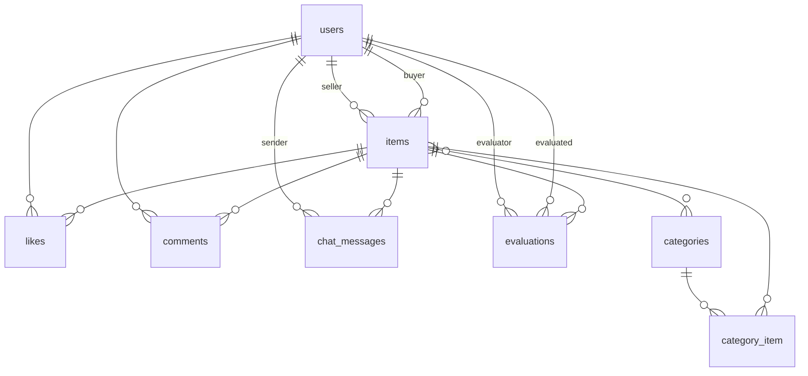

# coachtechフリマ

フリーマーケットアプリケーション

## 環境構築

**Dockerビルド**
1. `git clone https://github.com/ezashi/flea-market.git`
2. DockerDesktopアプリを立ち上げる
3. `docker-compose up -d --build`

**Laravel環境構築**
1. PHPコンテナに入る：`docker-compose exec php bash`
2. `composer install`
3. 「.env.example」ファイルから「.env」を作成し、環境環境変数を変更：`cp .env.example .env`
4. `.env`に以下の環境変数を追加・修正
```
DB_CONNECTION=mysql
DB_HOST=mysql
DB_PORT=3306
DB_DATABASE=laravel_db
DB_USERNAME=laravel_user
DB_PASSWORD=laravel_pass

MAIL_MAILER=smtp
MAIL_HOST=mailhog
MAIL_PORT=1025
MAIL_USERNAME=null
MAIL_PASSWORD=null
MAIL_ENCRYPTION=null
```
5. アプリケーションキーの作成：`php artisan key:generate`
6. マイグレーションの実行：`php artisan migrate`
7. シーディングの実行：`php artisan db:seed`
8. シンボリックリンクの作成：`php artisan storage:link`

## 使用技術(実行環境)
- PHP 7.4.9
- Laravel 8.83.8
- MySQL 8.0.26
- nginx 1.21.1
- Docker
- Docker-compose

## ER図


## URL
- **開発環境**: http://localhost/
- **phpMyAdmin**: http://localhost:8080/

| 機能 | URL | HTTPメソッド | 認証 |
|------|-----|-------------|------|
| 商品一覧 | `/` | GET | 不要 |
| マイリスト | `/?tab=mylist` | GET | 必要 |
| 会員登録 | `/register` | GET/POST | 不要 |
| ログイン | `/login` | GET/POST | 不要 |
| ログアウト | `/logout` | POST | 必要 |
| 商品詳細 | `/item/:item_id` | GET | 不要 |
| いいね機能 | `/items/:item_id/like` | POST | 必要 |
| コメント投稿 | `/items/:item_id/comment` | POST | 必要 |
| 商品出品 | `/sell` | GET/POST | 必要 |
| 商品購入 | `/purchase/:item_id` | GET | 必要 |
| 住所変更 | `/purchase/address/:item_id` | GET/POST | 必要 |
| 購入確定 | `/purchase/:item_id` | POST | 必要 |
| プロフィール登録 | `/profile` | GET/POST | 必要 |
| マイページ | `/mypage` | GET | 必要 |
| プロフィール編集(マイページ) | `/mypage/profile` | GET/POST | 必要 |
| 購入履歴 | `/mypage?tab=buy` | GET | 必要 |
| 出品履歴 | `/mypage?tab=sell` | GET | 必要 |
| 取引中商品 | `/mypage?tab=trade` | GET | 必要 |
| チャット画面 | `/chat/:item_id` | GET | 必要 |
| メッセージ送信 | `/chat/:item_id/send` | POST | 必要 |
| 取引完了 | `/items/:item_id/complete` | POST | 必要 |
| 評価投稿 | `/evaluation/:item_id` | POST | 必要 |


## 機能一覧

### 認証機能
- **会員登録**: ユーザー名、メールアドレス、パスワードで新規登録
- **ログイン/ログアウト**: メールアドレスとパスワードによる認証
- **プロフィール設定**: 初回登録後にプロフィール画像、住所情報を設定

### 商品機能
- **商品一覧表示**: 全商品の一覧表示（自分の出品を除く）
- **商品検索**: 商品名での検索機能
- **商品詳細表示**: 商品の詳細情報、コメント機能、いいね数を表示
- **商品出品**: 画像、商品名、説明、カテゴリー、状態、価格を設定して出品

### 購入機能
- **商品購入**: 支払い方法選択、配送先確認を経て購入処理
- **支払い方法選択**: コンビニ払い/カード払いから選択
- **配送先住所変更**: 購入時に配送先を変更可能

### 取引機能
- **チャット機能**: 売買成立後の取引相手とのメッセージのやり取り
- **メッセージ送信**: テキスト・画像の送信、編集・削除機能(テキストのみ編集可)
- **取引完了**: 購入者による取引完了処理
- **評価機能**: 取引完了後の相互評価システム
- **メール通知**: 取引完了時の出品者への自動通知

### ユーザー機能
- **マイページ**: ユーザー情報、購入/出品/取引履歴の表示
- **プロフィール編集**: プロフィール画像、名前、住所情報の更新
- **購入履歴**: 購入した商品の一覧表示
- **出品履歴**: 出品した商品の一覧表示
- **取引中商品**: 現在取引中の商品とチャット機能

#### テストユーザー情報
## 出品者アカウント1
- ユーザー名: Test_seller1
- メールアドレス: seller1@example.com
- パスワード: 12345678
## 出品者アカウント2
- ユーザー名: Test_seller2
- メールアドレス: seller2@example.com
- パスワード: 12345678
## ユーザーデータ
- ユーザー名: Test_buyer
- メールアドレス: buyer@example.com
- パスワード: 12345678
- 郵便番号: 100-8111
- 住所: 東京都千代田区
- 建物名: 千代田1-1


## テーブル仕様

### users
| カラム名 | データ型 | 制約 | 説明 |
|---------|---------|------|------|
| id | BIGINT UNSIGNED | PRIMARY KEY, AUTO_INCREMENT | ユーザーID |
| name | VARCHAR(255) | NOT NULL | ユーザー名 |
| email | VARCHAR(255) | NOT NULL, UNIQUE | メールアドレス |
| email_verified_at | TIMESTAMP | NULL | メール認証日時 |
| password | VARCHAR(255) | NOT NULL | パスワード（ハッシュ化） |
| profile_image | VARCHAR(255) | NULL | プロフィール画像パス |
| postal_code | VARCHAR(255) | NULL | 郵便番号 |
| address | VARCHAR(255) | NULL | 住所 |
| building | VARCHAR(255) | NULL | 建物名 |
| is_profile_completed | BOOLEAN | DEFAULT FALSE | プロフィール完了フラグ |
| remember_token | VARCHAR(100) | NULL | ログイン維持トークン |
| created_at | TIMESTAMP | NULL | 作成日時 |
| updated_at | TIMESTAMP | NULL | 更新日時 |

### items
| カラム名 | データ型 | 制約 | 説明 |
|---------|---------|------|------|
| id | BIGINT UNSIGNED | PRIMARY KEY, AUTO_INCREMENT | 商品ID |
| name | VARCHAR(255) | NOT NULL | 商品名 |
| brand | VARCHAR(255) | NULL | ブランド名 |
| description | TEXT | NOT NULL | 商品説明 |
| price | INT | NOT NULL | 価格 |
| condition | VARCHAR(255) | NOT NULL | 商品状態 |
| image | VARCHAR(255) | NULL | 商品画像パス |
| seller_id | BIGINT UNSIGNED | NOT NULL, FOREIGN KEY | 出品者ID（usersテーブル参照） |
| buyer_id | BIGINT UNSIGNED | NULL, FOREIGN KEY | 購入者ID（usersテーブル参照） |
| sold | BOOLEAN | DEFAULT FALSE | 売却済みフラグ |
| is_transaction_completed | BOOLEAN | DEFAULT FALSE | 取引完了フラグ |
| payment_method | VARCHAR(255) | NULL | 支払い方法 |
| created_at | TIMESTAMP | NULL | 作成日時 |
| updated_at | TIMESTAMP | NULL | 更新日時 |

### categories
| カラム名 | データ型 | 制約 | 説明 |
|---------|---------|------|------|
| id | BIGINT UNSIGNED | PRIMARY KEY, AUTO_INCREMENT | カテゴリーID |
| name | VARCHAR(255) | NOT NULL | カテゴリー名 |
| created_at | TIMESTAMP | NULL | 作成日時 |
| updated_at | TIMESTAMP | NULL | 更新日時 |

### category_item
| カラム名 | データ型 | 制約 | 説明 |
|---------|---------|------|------|
| id | BIGINT UNSIGNED | PRIMARY KEY, AUTO_INCREMENT | ID |
| category_id | BIGINT UNSIGNED | NOT NULL, FOREIGN KEY | カテゴリーID（categoriesテーブル参照） |
| item_id | BIGINT UNSIGNED | NOT NULL, FOREIGN KEY | 商品ID（itemsテーブル参照） |
| created_at | TIMESTAMP | NULL | 作成日時 |
| updated_at | TIMESTAMP | NULL | 更新日時 |

### conditions
| カラム名 | データ型 | 制約 | 説明 |
|---------|---------|------|------|
| id | BIGINT UNSIGNED | PRIMARY KEY, AUTO_INCREMENT | 状態ID |
| name | VARCHAR(255) | NOT NULL | 状態名 |
| created_at | TIMESTAMP | NULL | 作成日時 |
| updated_at | TIMESTAMP | NULL | 更新日時 |

### likes
| カラム名 | データ型 | 制約 | 説明 |
|---------|---------|------|------|
| id | BIGINT UNSIGNED | PRIMARY KEY, AUTO_INCREMENT | いいねID |
| user_id | BIGINT UNSIGNED | NOT NULL, FOREIGN KEY | ユーザーID（usersテーブル参照） |
| item_id | BIGINT UNSIGNED | NOT NULL, FOREIGN KEY | 商品ID（itemsテーブル参照） |
| created_at | TIMESTAMP | NULL | 作成日時 |
| updated_at | TIMESTAMP | NULL | 更新日時 |
| | | UNIQUE(user_id, item_id) | 重複いいね防止の複合ユニーク制約 |

### comments
| カラム名 | データ型 | 制約 | 説明 |
|---------|---------|------|------|
| id | BIGINT UNSIGNED | PRIMARY KEY, AUTO_INCREMENT | コメントID |
| user_id | BIGINT UNSIGNED | NOT NULL, FOREIGN KEY | ユーザーID（usersテーブル参照） |
| item_id | BIGINT UNSIGNED | NOT NULL, FOREIGN KEY | 商品ID（itemsテーブル参照） |
| content | TEXT | NOT NULL | コメント内容 |
| created_at | TIMESTAMP | NULL | 作成日時 |
| updated_at | TIMESTAMP | NULL | 更新日時 |

### chat_messages
| カラム名 | データ型 | 制約 | 説明 |
|---------|---------|------|------|
| id | BIGINT UNSIGNED | PRIMARY KEY, AUTO_INCREMENT | メッセージID |
| item_id | BIGINT UNSIGNED | NOT NULL, FOREIGN KEY | 商品ID（itemsテーブル参照） |
| sender_id | BIGINT UNSIGNED | NOT NULL, FOREIGN KEY | 送信者ID（usersテーブル参照） |
| message | TEXT | NOT NULL | メッセージ内容 |
| image_path | VARCHAR(255) | NULL | 画像パス |
| message_type | ENUM('text', 'both') | DEFAULT 'text' | メッセージタイプ |
| is_read | BOOLEAN | DEFAULT FALSE | 既読フラグ |
| is_edited | BOOLEAN | DEFAULT FALSE | 編集済みフラグ |
| is_deleted | BOOLEAN | DEFAULT FALSE | 削除済みフラグ |
| edited_at | TIMESTAMP | NULL | 編集日時 |
| deleted_at | TIMESTAMP | NULL | 削除日時 |
| created_at | TIMESTAMP | NULL | 作成日時 |
| updated_at | TIMESTAMP | NULL | 更新日時 |

### evaluations
| カラム名 | データ型 | 制約 | 説明 |
|---------|---------|------|------|
| id | BIGINT UNSIGNED | PRIMARY KEY, AUTO_INCREMENT | 評価ID |
| item_id | BIGINT UNSIGNED | NOT NULL, FOREIGN KEY | 商品ID（itemsテーブル参照） |
| evaluator_id | BIGINT UNSIGNED | NOT NULL, FOREIGN KEY | 評価者ID（usersテーブル参照） |
| evaluated_id | BIGINT UNSIGNED | NOT NULL, FOREIGN KEY | 被評価者ID（usersテーブル参照） |
| rating | INT | NOT NULL | 評価点数（1-5） |
| created_at | TIMESTAMP | NULL | 作成日時 |
| updated_at | TIMESTAMP | NULL | 更新日時 |
| | | UNIQUE(item_id, evaluator_id) | 重複評価防止の複合ユニーク制約 |

### personal_access_tokens
| カラム名 | データ型 | 制約 | 説明 |
|---------|---------|------|------|
| id | BIGINT UNSIGNED | PRIMARY KEY, AUTO_INCREMENT | トークンID |
| tokenable_type | VARCHAR(255) | NOT NULL | トークン対象のモデルタイプ |
| tokenable_id | BIGINT UNSIGNED | NOT NULL | トークン対象のID |
| name | VARCHAR(255) | NOT NULL | トークン名 |
| token | VARCHAR(64) | NOT NULL, UNIQUE | トークン値 |
| abilities | TEXT | NULL | トークンの権限 |
| last_used_at | TIMESTAMP | NULL | 最終使用日時 |
| created_at | TIMESTAMP | NULL | 作成日時 |
| updated_at | TIMESTAMP | NULL | 更新日時 |

### failed_jobs
| カラム名 | データ型 | 制約 | 説明 |
|---------|---------|------|------|
| id | BIGINT UNSIGNED | PRIMARY KEY, AUTO_INCREMENT | 失敗ジョブID |
| uuid | VARCHAR(255) | NOT NULL, UNIQUE | ジョブのユニークID |
| connection | TEXT | NOT NULL | 接続名 |
| queue | TEXT | NOT NULL | キュー名 |
| payload | LONGTEXT | NOT NULL | ジョブのペイロード |
| exception | LONGTEXT | NOT NULL | 例外情報 |
| failed_at | TIMESTAMP | DEFAULT CURRENT_TIMESTAMP | 失敗日時 |

### password_resets
| カラム名 | データ型 | 制約 | 説明 |
|---------|---------|------|------|
| email | VARCHAR(255) | NOT NULL, INDEX | メールアドレス |
| token | VARCHAR(255) | NOT NULL | リセットトークン |
| created_at | TIMESTAMP | NULL | 作成日時 |