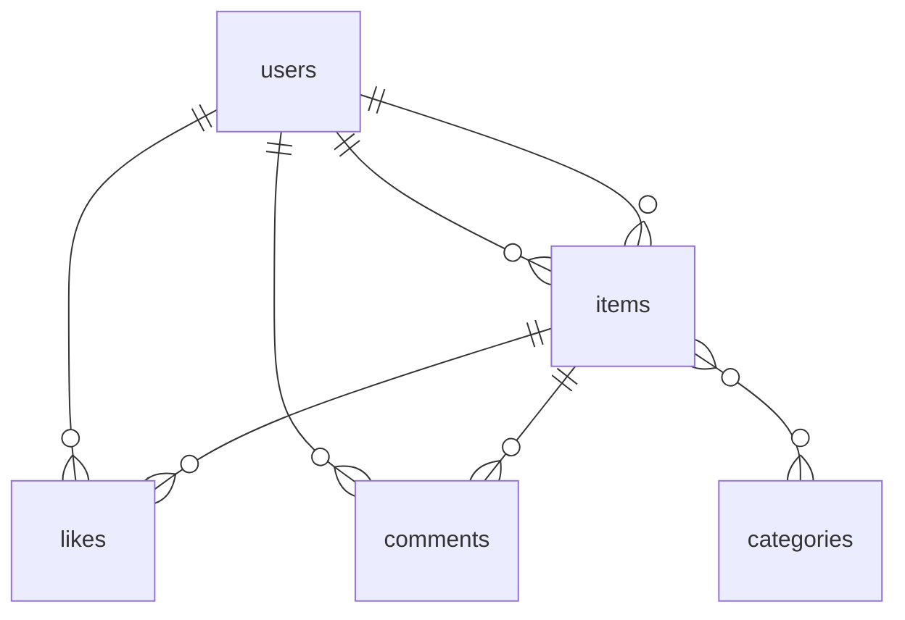

# coachtechフリマ

フリーマーケットアプリケーション

## 環境構築

**Dockerビルド**
1. `git clone https://github.com/ezashi/flea-market.git`
2. DockerDesktopアプリを立ち上げる
3. `docker-compose up -d --build`

**Laravel環境構築**
1. PHPコンテナに入る：`docker-compose exec php bash`
2. `composer install`
3. 「.env.example」ファイルから「.env」を作成し、環境環境変数を変更：`cp .env.example .env`
4. `.env`に以下の環境変数を追加
```
DB_CONNECTION=mysql
DB_HOST=mysql
DB_PORT=3306
DB_DATABASE=laravel_db
DB_USERNAME=laravel_user
DB_PASSWORD=laravel_pass
```
5. アプリケーションキーの作成：`php artisan key:generate`
6. マイグレーションの実行：`php artisan migrate`
7. シーディングの実行：`php artisan db:seed`
8. シンボリックリンクの作成：`php artisan storage:link`

## 使用技術(実行環境)
- PHP 7.4.9
- Laravel 8.83.8
- MySQL 8.0.26
- nginx 1.21.1
- Docker
- Docker-compose

## ER図


## URL
| 機能 | URL | HTTPメソッド | 認証 |
|------|-----|-------------|------|
| 商品一覧 | `/` | GET | 不要 |
| マイリスト | `/mylist` | GET | 必要 |
| 会員登録 | `/register` | GET/POST | 不要 |
| ログイン | `/login` | GET/POST | 不要 |
| ログアウト | `/logout` | POST | 必要 |
| 商品詳細 | `/item/{item}` | GET | 不要 |
| 商品購入 | `/purchase/{item}` | GET | 必要 |
| 住所変更 | `/purchase/address/{item}` | GET/POST | 必要 |
| 商品出品 | `/sell` | GET/POST | 必要 |
| マイページ | `/mypage` | GET | 必要 |
| プロフィール編集(マイページ) | `/mypage/profile` | GET/POST | 必要 |
| 購入履歴 | `/mypage/buy` | GET | 必要 |
| 出品履歴 | `/mypage/sell` | GET | 必要 |
| プロフィール登録・編集 | `/profile` | GET/POST | 必要 |
| 支払い方法選択 | `/purchase/{item}/payment` | POST | 必要 |
| 購入確定 | `/purchase/{item}` | POST | 必要 |
| いいね機能 | `/items/{item}/like` | POST | 必要 |
| コメント投稿 | `/items/{item}/comment` | POST | 必要 |


## 機能一覧

### 認証機能
- **会員登録**: ユーザー名、メールアドレス、パスワードで新規登録
- **ログイン/ログアウト**: メールアドレスとパスワードによる認証
- **プロフィール設定**: 初回登録後にプロフィール画像、住所情報を設定

### 商品機能
- **商品一覧表示**: 全商品の一覧表示（自分の出品を除く）
- **商品検索**: 商品名での検索機能
- **商品詳細表示**: 商品の詳細情報、コメント、いいね数を表示
- **商品出品**: 画像、商品名、説明、カテゴリー、状態、価格を設定して出品

### 購入機能
- **商品購入**: 支払い方法選択、配送先確認を経て購入処理
- **支払い方法選択**: コンビニ払い/カード払いから選択
- **配送先住所変更**: 購入時に配送先を変更可能

### ユーザー機能
- **マイページ**: ユーザー情報、購入/出品履歴の表示
- **プロフィール編集**: プロフィール画像、名前、住所情報の更新
- **購入履歴**: 購入した商品の一覧表示
- **出品履歴**: 出品した商品の一覧表示

### コミュニケーション機能
- **いいね機能**: 商品に対するいいねの追加/削除
- **マイリスト**: いいねした商品の一覧表示
- **コメント機能**: 商品に対するコメント投稿

### その他の機能
- **Sold表示**: 購入済み商品にSoldマークを表示
- **画像アップロード**: プロフィール画像、商品画像のアップロード